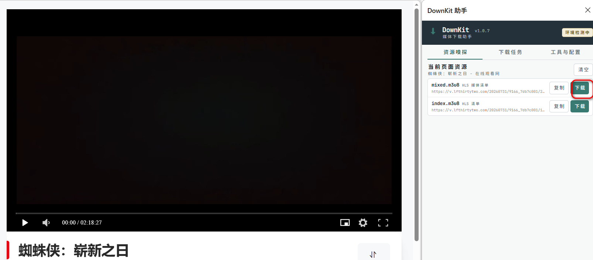
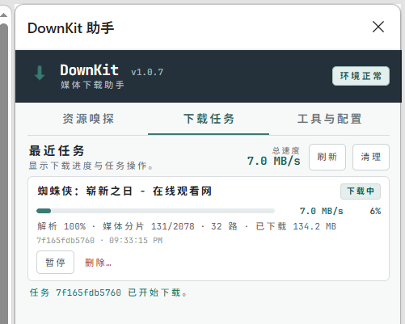
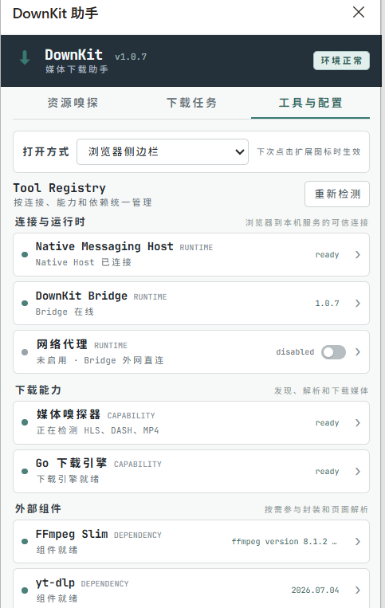

# DownKit

DownKit 是一个通过 Chrome 或 Edge 扩展发现网页中的 M3U8、DASH 和 MP4 媒体，并交给本机 Bridge 下载和封装的跨平台工具。

## 字幕能力

Windows 版支持在下载媒体的同时生成独立字幕文件：

- 优先下载网站提供的人工字幕或自动字幕；
- 原站没有所需字幕时，可使用随发行包提供的 whisper.cpp 客户端在本机识别语音；
- 可使用随发行包提供的 llama.cpp 和 TranslateGemma 在本机生成译文或双语 SRT；
- 音频提取、语音识别、模型加载、逐条翻译和字幕生成均显示独立阶段与真实进度。

Whisper 和 TranslateGemma 模型权重不包含在发行包内。请在扩展的“工具与配置”中选择模型、阅读相应许可并按需下载；下载完成后无需使用命令行。Linux 和 macOS 发行包目前不携带本地 ASR/翻译 sidecar。

## 使用效果

<table>
  <tr>
    <td width="64%"></td>
    <td width="36%"></td>
  </tr>
  <tr>
    <td align="center">检测当前页面的媒体资源并发起下载</td>
    <td align="center">查看实时速度、进度与任务状态</td>
  </tr>
  <tr>
    <td colspan="2" align="center">
       
      检查 Bridge、下载能力与外部组件状态
    </td>
  </tr>
</table>

## 安装与使用

Windows、Linux 和 macOS 的整体流程相同：加载浏览器扩展、注册本机 Bridge，然后由浏览器按需自动启动 Bridge；无需手动常驻运行 Bridge。

### Windows

1. 从 [GitHub Releases](https://github.com/ThinkerQAQ/downkit/releases) 下载 Windows 发行包并解压到固定目录，不要单独移动 Bridge、`extension` 或 `tools` 目录。
2. 双击运行 `安装-Windows.cmd`。脚本会注册 Native Messaging Host，使 Chrome 和 Edge 能够自动启动 Bridge。
3. 打开 `edge://extensions` 或 `chrome://extensions`，启用“开发人员模式”，选择“加载解压缩的扩展”，然后选择发行包中的 `extension` 目录。
4. 打开包含媒体的网页并开始播放，点击 DownKit 扩展图标，在检测到的资源中选择需要的项目并开始下载。
5. 如果移动了解压目录或替换了 Bridge，请重新运行 `安装-Windows.cmd`。需要卸载时，先运行 `卸载-Windows.cmd`，再从浏览器中移除扩展。

### Linux 和 macOS

1. 从 [GitHub Releases](https://github.com/ThinkerQAQ/downkit/releases) 下载与系统和 CPU 架构匹配的发行包并解压到固定目录。
2. Linux 在终端进入解压目录并运行 `./Install-Linux.sh`；macOS 运行 `./Install-macOS.command`。如果系统提示没有执行权限，先执行 `chmod +x Install-Linux.sh` 或 `chmod +x Install-macOS.command`。脚本会自动识别架构并注册 Chrome、Chromium 和 Edge。
3. Linux/macOS 发布包不携带 FFmpeg，请先通过系统包管理器安装 `ffmpeg` 并确保它在 `PATH` 中，以便完成媒体合并和封装。
4. 打开 `edge://extensions` 或 `chrome://extensions`，启用“开发人员模式”，选择“加载解压缩的扩展”，然后选择发行包中的 `extension` 目录。
5. 打开包含媒体的网页并开始播放，点击 DownKit 扩展图标，在检测到的资源中选择需要的项目并开始下载。

如果移动了解压目录，请重新运行安装脚本。卸载时运行同目录下的 `Uninstall-Linux.sh` 或 `Uninstall-macOS.command`，再从浏览器中移除扩展。

## 许可证

DownKit 自有代码和文档采用 [Apache License 2.0](LICENSE)；随项目分发的第三方组件仍遵循各自的许可证，详情见 [NOTICE](NOTICE) 和 [THIRD_PARTY_NOTICES.md](THIRD_PARTY_NOTICES.md)。
